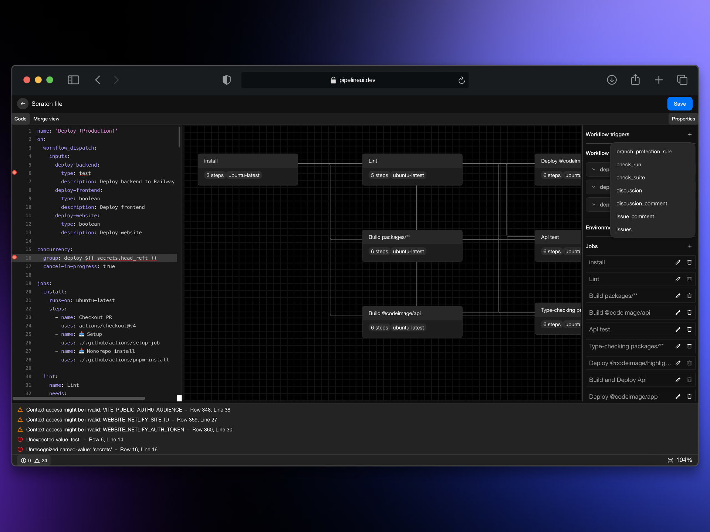
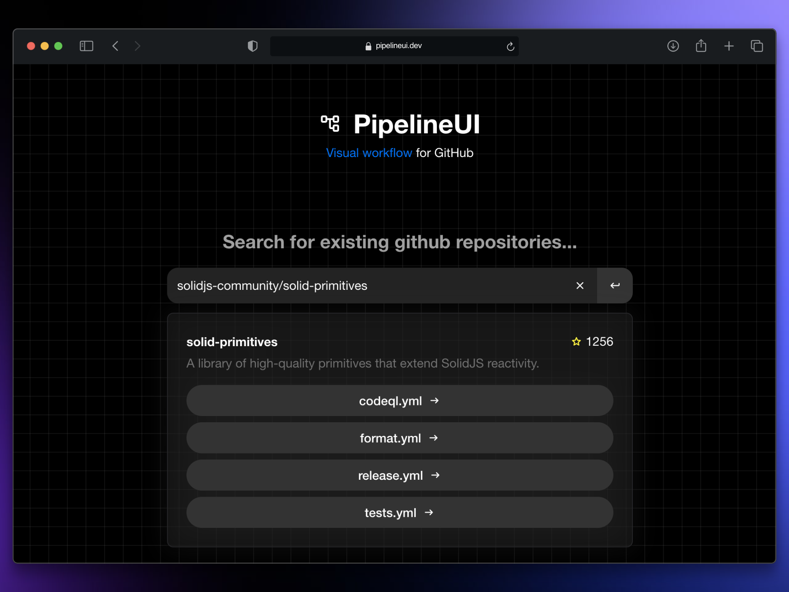
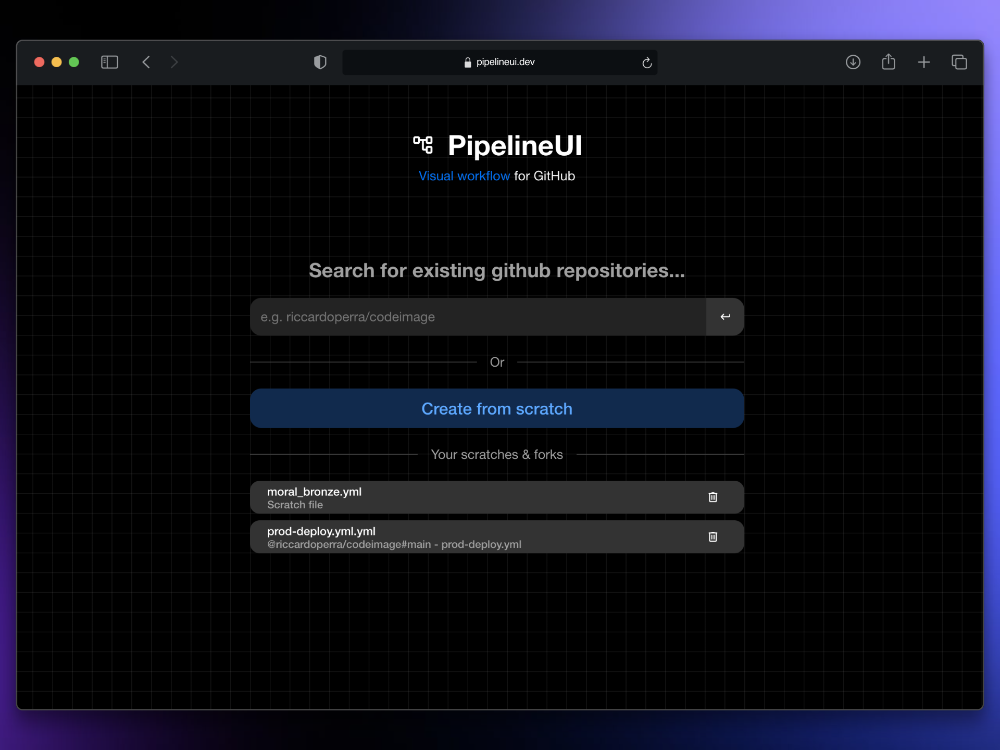

<picture>
  <source media="(prefers-color-scheme: dark)" srcset="./docs/logo_for_github_white.svg">
  
</picture>

---

Pipeline UI is a free, open-source visual editor for visualizing, creating and managing GitHub Actions workflows.
Built with SolidStart, this tool simplifies the process of creating GitHub pipelines
by allowing users to visualize, create and update existing CI/CD workflows.

> [!NOTE]
>
> This project has been built to partecipate in [SolidHack 2024](https://www.solidjs.com/blog/solidhack-2024-announcement)
> and [Appwrite’s Hacktoberfest 2024 Hackathon](https://appwrite.io/blog/post/appwrite-hacktoberfest-hackathon-2024).
>
> Although there are some alternative solutions that can help a lot writing workflow files
> directly from IDE, this project mainly is a MVP to discover new technologies
>
> The amount of time dedicated in this project is very limited, and the features needed for a complete project are numerous.
> Therefore, some features will **undoubtedly be missing** and may be implemented in the future.

## Disclaimer for hackathon entry

This project will be submitted for these two hackathons:

- [SolidHack 2024](https://hack.solidjs.com/)
- [AppWrite's Hacktoberfest 2024 Hackathon](https://appwrite.io/blog/post/appwrite-hacktoberfest-hackathon-2024)

Since they have two different deadlines, development will be subdivided into two branches until the two hackathon ends:

- [main](https://github.com/riccardoperra/pipelineui/tree/main): Source code to be submitted for SolidHack
- [appwrite](https://github.com/riccardoperra/pipelineui/tree/appwrite): Source code to be submitted for Appwrite Hackathon

Those two branches are linked in a multi-environment railway project which is currently visible to everyone: [Railway Deployment](https://railway.app/project/8e131c67-73c1-4ab6-9fa4-31dfa6c9000e).

GitHub workflow that deploy the app: [deploy.yml](https://github.com/riccardoperra/pipelineui/blob/main/.github/workflows/deploy.yml)

Github environment deployments:

- [Appwrite](https://github.com/riccardoperra/pipelineui/deployments/appwrite)
- [Production (SolidHack)](https://github.com/riccardoperra/pipelineui/deployments/production)

## Table of contents

- [Features](#features)
  - [Available editor features](./packages/app/src/routes/about/supported-workflow-features.mdx){:target="\_blank"}
- [Technical info](#-technical-info)
  - [UI](#ui)
  - [GitHub API](#github-api)
  - [State Management](#state-management)
  - [YAML Editor](#yaml-editor)
  - [Flow diagram](#flow-diagram)
  - [Backend](#backend)
  - [Other dependencies](#other)
  - [Hosting](#hosting)

## Features

### ✅ Built-in editor

Visualize and/or modify your workflow file through a simple UI.

- View your steps dependency graph through the main interactive canvas
- Check your workflow validity through the YAML Viewer and it's linter, which immediately tell you if your file respect the [GitHub Workflow Syntax](https://docs.github.com/en/actions/writing-workflows/workflow-syntax-for-github-actions) thanks to the GitHub Language Service integration.
- Modify your workflow file updating the Properties panel in the right side.

> [!NOTE]
>
> [Read here all available editor features](./packages/app/src/routes/about/supported-workflow-features.mdx)

### ✅ Search for existing GitHub workflows

What if you already have an existing workflow file pushed in your repository? You can use the built-in search to get all workflows
of your repository.

### ✅ Create your own workflows files

If you haven't an existing workflow file, you can create it from scratch if you're authenticated.

Workflow files are persisted into [AppWrite Cloud](https://appwrite.io/) and **are publicly readable to everyone that now the shareable link**.

## 🤖 Technical info

PipelineUI is entirely built with [Solid](https://github.com/solidjs/solid) and [SolidStart](https://github.com/solidjs/solid-start)
with enabled SSR.

The core technical points of this project can be summarized in those bullet items:

- SolidStart SSR with mutations and server functions for session, workflow and scratches crud
- Language Service Protocol and Linter integration with CodeMirror via web-worker
- MDX prerendered routes for /about pages
  - [About](https://pipelineui.dev/about)
  - [Supported workflow features](https://pipelineui.dev/about/supported-workflow-features)
- Editor local first state management with statebuilder via plugin, with YAML synchronization
- Usage of [Lingui](lingui.dev) for i18n
- Appwrite OAuth integration with SolidStart API routes
- Appwrite Database integration with SolidStart server functions

### User interface

The user interface has been built with:

- [@kobalte/core](https://github.com/kobaltedev/kobalte): Accessible components for SolidJS
- [@solid-primitives/\*](https://github.com/solidjs-community/solid-primitives): SolidJS primitives library
- [corvu](https://corvu.dev/): UI primitives for SolidJS
- [vanilla-extract](https://vanilla-extract.style/): Zero-runtime CSS in typescript

> [!WARNING]
>
> The source code of [@vanilla-extract/vite-plugin](https://github.com/vanilla-extract-css/vanilla-extract/tree/master/packages/vite-plugin) has been patched
> in order to support solid start w/ vinxi for multi-environment ssr/csr build.
>
> [Patch file](./patches/@vanilla-extract__vite-plugin@4.0.17.patch)
>
> [Custom app config](./packages/app/app.config.ts)

---

### GitHub API

This project uses [ungh](https://github.com/unjs/ungh) from UnJS in order to call GitHub API.

---

### State Management

This project uses [statebuilder](https://github.com/riccardoperra/statebuilder) to handle local state.

See some implementations in `store` folder:

- [packages/app/src/store/editor](packages/app/src/store/editor)

---

### YAML Editor

- [CodeMirror6](https://codemirror.net/): used to display the YAML editor and merge view. The LSP integration is a revisited version of [codemirror-languageserver](https://github.com/FurqanSoftware/codemirror-languageserver), which was a
  good starting point to integrate the GitHub workflow language server.
  - Portion of CodeMirror implementation is present in the [@pipelineui/yaml-editor](./packages/yaml-editor)
- [actions/languageservices](https://github.com/actions/languageservices): The language service repo for GitHub
  workflows and expressions. This was used to parse the workflow files and validate them, and enhance the editor code
  through linting and hover-in code documentation.

> [!WARNING]
>
> The source code of @actions/workflow-parser has been patched and rebuilt in order to work on vite in node/browser environment without getting errors and to
> extend some functionalities needed to the workflow yaml parser and lsp that were not available before.
>
> Currently @actions/languageserver has been wrapped to ship only browser compatible packages with the built-in workflow-parser patch.
>
> Read more about this in the package [README](./packages/workflow-parser/README.md).
>
> [MIT License](https://github.com/actions/languageservices/blob/main/LICENSE)
>
> [My patch file](./patches/@actions__workflow-parser@0.3.13.patch)

---

### Flow diagram

The implemented Flow diagram is very basic and it has been built with solid taking advantage of some other dependencies:

- [elkjs](https://github.com/kieler/elkjs): ELK layout algorithm, used to calculate the flow item positions
- [panzoom](https://github.com/anvaka/panzoom): Cross-browser compatible pan and zoom library
- [@xyflow/system](https://github.com/xyflow/xyflow): Core of xyflow, currently used to build the smooth edge curve
  svg
  - [smootstep-edge.ts](https://github.com/xyflow/xyflow/blob/97fdff59d40071aee0b3192f7b571c6bdd4d09fd/packages/system/src/utils/edges/smoothstep-edge.ts#L215)

---

### Backend

Backend persistence and authentication has been done with [appwrite](https://appwrite.io/).

Used Appwrite features:

- Auth
- Database

Most of the Appwrite code is available into

- [packages/app/src/lib/server](packages/app/src/lib/server).
- [packages/app/src/lib/scratchApi.ts](packages/app/src/lib/scratchApi.ts).
- [packages/app/src/routes/api/oauth.ts](packages/app/src/routes/api/oauth.ts).

---

### Other dependencies

Here's a list of my personal dependencies, which they have been used to be tested and improved during the development.

- [@codeui/kit](https://github.com/riccardoperra/codeui): [CodeImage](https://github.com/riccardoperra/codeimage) design
  system (Kobalte + VanillaExtract)
- [statebuilder](https://github.com/riccardoperra/statebuilder): Pluggable state management
- [solid-codemirror](https://github.com/riccardoperra/solid-codemirror): SolidJS adapter for CodeMirror

---

### Hosting

This application is hosted on Railway. Deploy are made via github action CI/CD

- [Workflow file](./.github/workflows/deploy.yml)
- [See the workflow file inside PipelineUI](https://pipelineui.dev/editor/riccardoperra/pipelineui/main/.github/workflows/deploy.yml)
